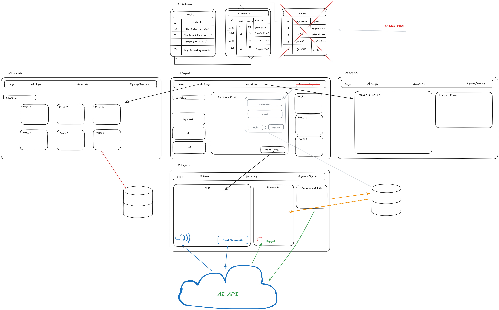
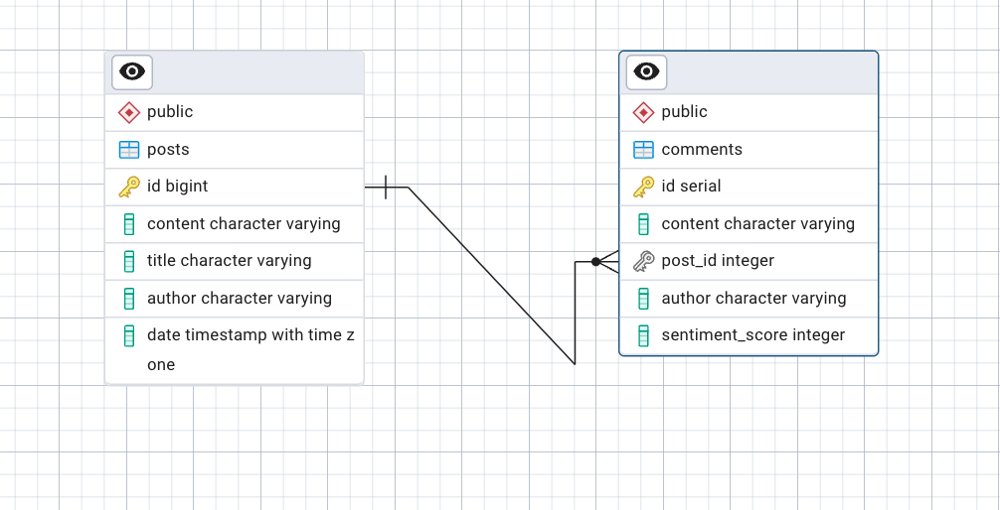
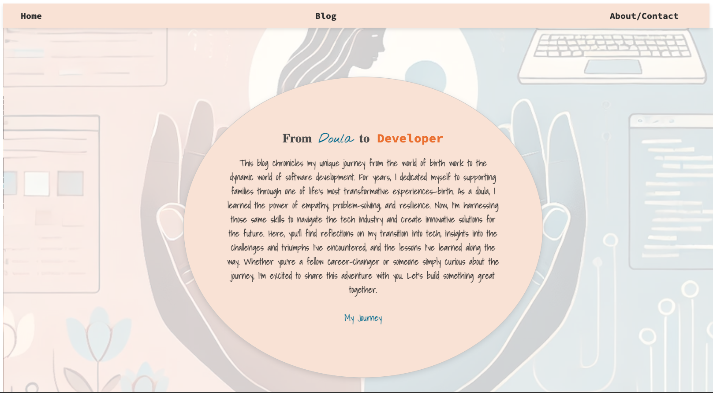

# Doula to Developer Blog

## Overview

Welcome to the **Doula to Developer Blog**, a personal journey blog documenting the transition from a birth worker to a software developer. This blog showcases my experiences, challenges, and the lessons I’ve learned throughout my career change.

The project features:
- Full CRUD operations for blog posts and comments.
- AI-powered content moderation using OpenAI's Moderation API for comments.
- Sentiment analysis to gauge the tone of each comment.
- A "Text-to-Speech" feature that reads posts aloud using the OpenAI API.
- Responsive design with clean, accessible user interfaces.
- Tests for key components using `Vitest` and `React Testing Library`.

## Table of Contents
- [Requirements](#requirements)
- [Features](#features)
- [Technologies Used](#technologies-used)
- [Design](#design)
- [Demo](#Demo)
- [Setup](#setup)
- [Running Tests](#running-tests)
- [API Endpoints](#api-endpoints)
- [Contributing](#contributing)

## Project Requirements

This project involves building a full-stack blog app to showcase your skills in creating and managing web applications. The blog should include at least 3 posts stored in a PostgreSQL database and an AI-powered feature of your choice.

### Core Concepts
- By the end of the project, you should be comfortable with:

- React: props, state, callback functions, component reuse

- CRUD Operations: Create, Read, Update, Delete blog posts and comments

- SQL: Creating and joining tables, searching for data, using Postgres

- Routing: Both on the frontend and backend

- Styling: Ensure your app is well-designed with CSS

- Testing: Add at least one test to your React components

### Key Features

Backend:

- Use PostgreSQL and Express to manage and connect the database.
- All data should come from the database, no hardcoding on the frontend.
- Include a seed file with at least 3 posts.

Frontend:
- Display a list of blog posts.
- Include a form to create new blog entries with required and optional fields.
- Allow users to view individual post details.
- Add reusable components.
- AI Feature: Choose and implement one AI feature.

Pull Request Requirements
- Ensure the PR is clean and only includes relevant project files.
- Include a .gitignore to exclude unnecessary files like node_modules.
- Provide a detailed top-level README file.

## Features

### Blog Features:
- Users can create and read blog posts.
- Each post has a detailed view, including author, title, and content.
- Posts can be read aloud using the OpenAI Text-to-Speech API.
- Visitors can comment on blog posts.
- Comment moderation is powered by OpenAI to filter inappropriate content.

### Comment Features:
- AI moderation to block inappropriate comments.
- Sentiment analysis to display comment tone.
- Collapsible comment sections with smooth animations.
- Add, delete, and view comments on individual posts.


## Technologies Used

- **Frontend**: React, CSS
- **Backend**: Node.js, Express.js
- **Database**: PostgreSQL
- **AI Integration**: OpenAI API (Moderation, Text-to-Speech)
- **Testing**: Vitest, Testing Library

## Design

### Wireframe

### Database Schema


## Demo




[Link to Full Demo on YouTube](https://www.youtube.com/watch?v=ielfp3nv5xc)


## Setup

To run this project locally, follow these steps:

1. **Clone the repository**:
    ```bash
    git clone git@github.com:MBHunter88/blog-app.git
    cd blog-app
    ```

2. **Install dependencies**:
    Install packages for both the client and server applications.
    ```bash
    cd client && npm install
    cd ../server && npm install
    cd ..
    ```

3. **Set up environment variables**:
   Create environment files for development and production.
   
   **.env.development**
   ```bash
   DATABASE_URI=your_postgres_database_url
   OPENAI_API_KEY=your_openai_api_key
   API_KEY=your_api_token
   PORT=8181
   VITE_API_URL=http://localhost:8181
   VITE_ADMIN_ENABLED=true
   ```
   
   **.env.production**
   ```bash
   DATABASE_URI=your_postgres_database_url
   OPENAI_API_KEY=your_openai_api_key
   PORT=8181
   VITE_API_URL=https://your-production-url
   VITE_ADMIN_ENABLED=false
   ```
   The `API_KEY` value is only included in development so you can test admin actions locally. Production builds omit this variable so public deployments cannot access admin routes or UI.

4. **Initialize the database**:
   Ensure your PostgreSQL server is running and load the schema and seed data:
    ```bash
    psql -d your_database -f server/db.sql
    ```

5. **Start the development servers**:
    Run the backend and frontend in separate terminals.
    ```bash
    npm run server --prefix server
    npm run dev --prefix client
    ```

The blog will now be accessible at `http://localhost:8181`.

### Admin Login

If `VITE_ADMIN_ENABLED` is set to `true`, navigate to `/login` and enter the token from `API_KEY` to unlock admin controls. This route and the related UI are removed in production where `VITE_ADMIN_ENABLED=false`.

## Railway Deployment

When deploying on [Railway](https://railway.app/), configure these environment variables:

**Required**

- `DATABASE_URI`
- `OPENAI_API_KEY`
- `PORT` (usually `8181`)
- `VITE_API_URL` (your Railway app URL)
- `VITE_ADMIN_ENABLED` (`false` for production)

**Optional for development previews**

- `API_KEY` (enables admin routes)
- Set `VITE_ADMIN_ENABLED` to `true` if you include `API_KEY`

## Running Tests

This project uses `Vitest` for unit and integration tests. To run the tests:

```bash
npm run test
```

To check test coverage:

```bash
npm run coverage
```

## API Endpoints

### Posts
- `GET /api/posts`: Fetch all approved blog posts.
- `GET /api/posts/:postId`: Fetch a specific approved blog post by ID.
- `POST /api/posts`: Create a new blog post (immediately approved).
- `POST /api/posts/generate`: Generate a post with OpenAI (requires API key, saved as unapproved).
- `PATCH /api/posts/:postId/approve`: Approve an unapproved post (requires API key).
- `DELETE /api/posts/:postId`: Delete a specific blog post by ID.

Newly generated posts are saved as unapproved. Only approved posts appear in public GET requests. Use the approval endpoint to publish AI-generated drafts.

### Comments
- `GET /api/comments/:postId`: Fetch comments for a specific blog post.
- `POST /api/posts/:postId/comments`: Add a comment to a specific blog post.
- `DELETE /api/posts/:postId/comments/:commentId`: Delete a specific comment.

### AI Features
- `GET /api/posts/:postId/speech`: Generate Text-to-Speech audio for a specific post.
- `POST /api/posts/:postId/comments` : Add a commment to a specific blog post that can be flagged for inappropriate content. 

## Contributing

Contributions are welcome! Please follow these steps to contribute:

1. Fork the repository.
2. Create a new branch (`git checkout -b feature-branch`).
3. Make your changes and commit them (`git commit -m 'Add new feature'`).
4. Push your branch (`git push origin feature-branch`).
5. Open a Pull Request.
